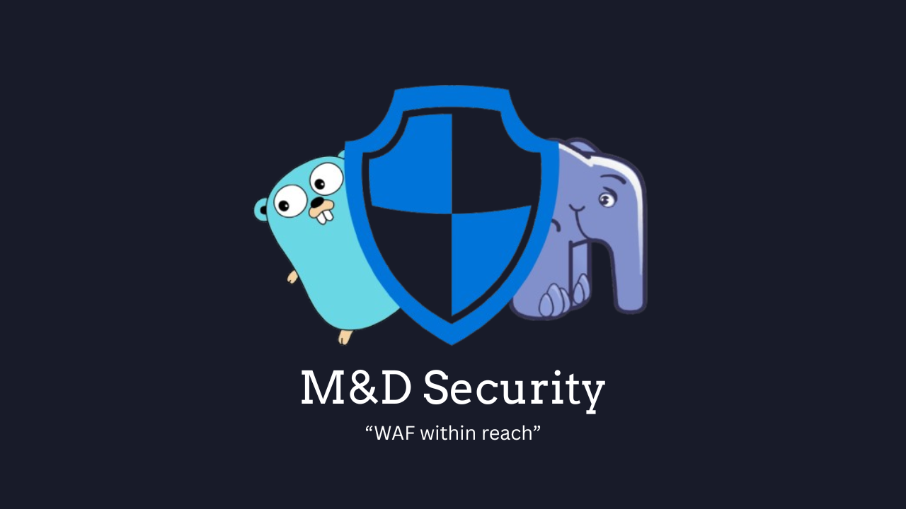

# M&DSecurity - 🔥An open-source WAF

**M&DSecurity** ([Manager](https://github.com/twoNDchances/madsecurity-manager) & [Defender](https://github.com/twoNDchances/madsecurity-defender)) is a **WAF** (Web Application Firewall) with an easy-to-use management interface, clear and extensible rule system. **M&DSecurity** allows intervention in the lifecycle of an HTTP request (including Request & Response), detects potential threats inside, and takes appropriate actions.

This project is inspired by [ModSecurity](https://modsecurity.org/) (Apache License 2.0).

---

## References

- [Vietnamese](https://vast-cross-9bd.notion.site/Vie-M-DSecurity-24fbc3ab42358095b032f715ff1d70a5)  
- [English](https://vast-cross-9bd.notion.site/Eng-M-DSecurity-24cbc3ab423580ca99f0c7a7b23ecde8)

---
> **🚀 Crafted with passion by [2ndProject](https://github.com/twoNDchances) — Innovating Security, Empowering Developers.**
